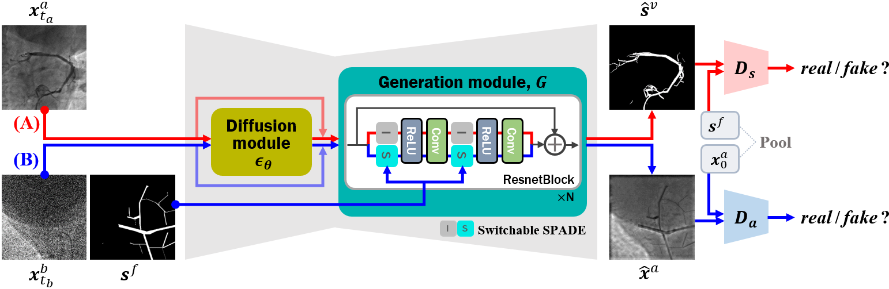

# Diffusion Adversarial Representation Learning for Self-supervised Vessel Segmentation

This repository is the official implementation of "Diffusion Adversarial Representation Learning for Self-supervised Vessel Segmentation".

[[ICLR 2023](https://openreview.net/forum?id=H0gdPxSwkPb)]
[[arXiv](https://arxiv.org/abs/2209.14566)]



## Requirements
  * OS : Ubuntu
  * Python >= 3.6
  * PyTorch >= 1.4.0

## Data
In our experiments, we used the publicly available XCAD dataset. Please refer to our main paper.

## Training

To train our model, run this command:

```train
python3 main.py -p train -c config/train.json
```

## Test

To test the trained our model, run:

```eval
python3 main.py -p test -c config/test.json
```

## Pre-trained Models

You can download our pretrained model of XCAD dataset [here](https://drive.google.com/file/d/1Kuh-YEhRaR4LEsltnXflnJgxSoTx06j5/view?usp=sharing).
Then, you can test the model by saving the pretrained weights in the directory ./pretrained_model.
To brifely test our method given the pretrained model, we provided the toy example in the directory './data/'.
